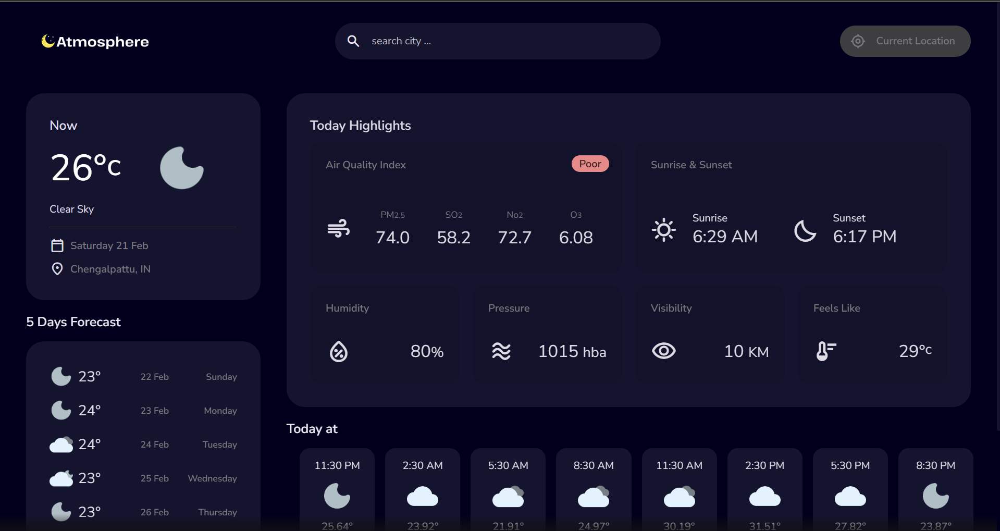
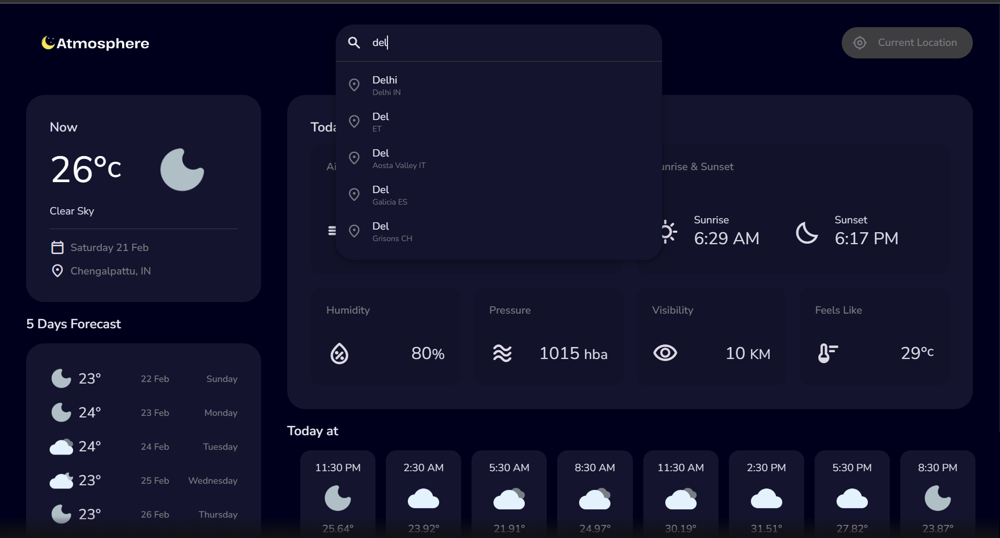

<h1 align="center" id="title">Atmosphere</h1>

<p align="center"></p>

<p id="description">A sleek responsive web application that provides accurate real-time weather data for cities worldwide. Built using HTML CSS and JavaScript it integrates the OpenWeather API to fetch live weather conditions forecasts and environmental metrics.</p>

<h2>🚀 Demo</h2>

[https://jiya19g.github.io/Atmosphere-2.0/](https://jiya19g.github.io/Atmosphere-2.0/)

<h2>Project Screenshots:</h2>





  
  
<h2>🧐 Features</h2>

Here're some of the project's best features:

*   Search by City – Get weather updates for any location.
*   Current Location Support – Auto-detects your location.
*   5-Day Forecast – View future weather trends.
*   Wind Speed Humidity and More – Comprehensive weather details.
*   Smooth UI experience
*   Deployed on GitHub Pages

<h2>🛠️ Installation Steps:</h2>

<p>1. Clone the repository</p>

```
git clone https://github.com/jiya19g/Atmosphere-2.0.git
```

<p>2. Change directory</p>

```
 cd Atmosphere
```

<p>3. Set Up a Virtual Environment</p>

```
python -m venv venv 
```

```
venv\Scripts\activate
```

<p>5. API Testing (Pytest)</p>

```
pytest tests/ --html=report.html --self-contained-html
```

<p>6. Load Testing (Locust)</p>

```
locust
```

  
  
<h2>💻 Built with</h2>

Technologies used in the project:

*   html
*   css
*   javascript
*   Deployment: GitHub Pages
